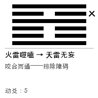
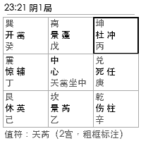
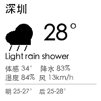
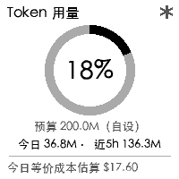

# pocket-prophet-dashboard

给"口袋先知"墨水屏做的功能扩展：一个本地 Web 服务，让这块 200×200 的小屏幕显示自定义内容——**摇一卦**、起一盘**奇门遁甲**、看天气、看股票行情、看今日要闻、看 Claude Code 的 token 消耗。全部通过设备官方已经暴露的能力实现，不逆向、不刷机（详见下方「定位」）。

<p align="center">
     
</p>

---

## 快速开始

```bash
git clone https://github.com/BruceLanLan/pocket-prophet-dashboard.git
cd pocket-prophet-dashboard
pip install -r requirements.txt

cp config.example.json config.json
# 编辑 config.json：填入设备的局域网 IP（在设备上打开"更换壁纸"界面时
# 能看到），MAC 地址可选（填了的话 IP 变了会自动找回）

python3 app.py
```

启动后访问 `http://<这台电脑的局域网IP>:5151`（同一 WiFi 下手机也能打开）。

**用之前有一件事必须知道：设备平时不联网。** 它只在手动打开设备上的"更换壁纸"界面时才会加入局域网，退出界面就立刻断开（实测确认，日志见 [`docs/evidence/`](docs/evidence/)）。两种用法：

- **手动**：打开设备的"更换壁纸"界面 → 打开这个 Web 页面点一下想要的功能 → 看设备屏幕
- **自动**（见下方「自动推送」）：把设备**一直搁在**"更换壁纸"界面上，服务按周期自动轮换推送——已实测确认停驻在该界面时屏幕显示的就是壁纸内容本身（不是二维码/配置页），停驻期间设备会持续在线

页面顶部的状态点会告诉你设备现在在不在线；不在线时点按钮会给出"请先打开更换壁纸界面"的提示，不会报错崩溃。

---

## 功能

| 功能 | 说明 |
|---|---|
| 🔮 **摇卦** | 三枚铜钱法起六爻，服务端用密码学安全随机数（`secrets`，不是 `random`）真实抛掷。给出本卦、变卦（如有动爻）、和一句判断 |
| 🌤️ **天气** | 数据源 [wttr.in](https://wttr.in)，城市在设置页里改。图标+温度并排，另有体感温度和降水概率。图标是纯 PIL 几何图形（不用外部图标字体，位图在 200×200 下容易糊），覆盖晴/多云/阴/雨/雪/雾/雷 7 类 |
| 📈 **行情** | 数据源 Yahoo Finance 公开接口，股票清单在设置页里改。两种版式：概览（多只，各配一条分时线）或详情（清单第一只占满整屏，含成交量/52周高低），设置页切换 |
| 📰 **要闻** | 多个 RSS/Atom 源合并（round-robin，不会被单一源占满），设置页可增删排序，任意公开 RSS 2.0/Atom 地址都支持，另有今日头条热榜作为特殊源 |
| 📊 **Token 用量** | 解析本机 Claude Code 的本地转录文件，环形进度显示"今日消耗/自设预算"百分比（预算数值本身画在屏幕上，标注"自设"）、近 5 小时窗口、近似成本估算。**这不是官方订阅额度百分比**——那个数据本地拿不到，百分比是相对你在设置页自己填的预算算的 |
| 🔯 **奇门遁甲** | 按当前时间起盘（节气定局/阴阳遁/值符值使/三盘，复用同一作者 mingli-skill 项目的排盘引擎），3×3 九宫格显示门/星/干支，粗框标出值符宫 |

摇卦是"推了就看"的一次性动作；天气/行情/新闻/用量四页支持先"预览"（只调用转换接口生成预览图，**不会**真的推给设备）再决定要不要"推送"。

---

## 自动推送（停驻模式）

设备如果**一直停留**在"更换壁纸"界面（不退出），会持续在线，屏幕也持续显示推送内容——这一点已经实测确认过（见 [`docs/PHASE0_FINDINGS.md`](docs/PHASE0_FINDINGS.md)）。基于这个前提，设置页里可以打开"自动推送"：按你设定的周期（默认 10 分钟，最低 5 分钟）自动轮换推送选中的页面，不需要每次手动点。

**默认关闭，需要在设置页显式打开。** 两个使用前提：

- 只在设备**持续停留**在传壁纸界面时才有效——这段时间不要用官方 App/网页给设备传自己的图，会被自动推送覆盖
- 设备没有电量接口，长时间停驻联网对续航的影响未知

首页顶部会显示布防状态、下次推送时间、上次推送结果。

---

## 设置页

访问 `/settings` 可以改：

- 设备 IP / MAC
- 天气城市（默认深圳）
- 股票清单（默认 `AAPL`、`NVDA`，逗号分隔）+ 行情版式（概览/详情）
- 要闻源：增删、用上下箭头调整优先级，支持任意 RSS 2.0/Atom 地址
- 每日 token 预算（自设，用于用量页百分比，不是官方额度）
- 自动推送：布防开关、推送周期、参与轮换的页面

改完点保存即可，不需要重启服务。

---

## 项目结构

```
pocket-prophet-dashboard/
  app.py                    # Flask 服务：路由 + 页面注册表
  config.py / config.json   # 运行时配置读写
  device.py                 # 设备通信：云端图片转换 + 局域网推送
  providers/                # 各功能的数据抓取（天气/行情/新闻/用量/起卦）
  renderer/                 # 各功能的 200×200 图像渲染
  templates/                # 网页（首页 + 设置页）
  history/                  # 每次推送前的源图备份（设备没有读回接口，这是唯一的回滚依据）
  scripts/                  # 早期设备探测脚本，开发调试用，不是运行本项目所必需
  docs/                     # 见下方文档索引
```

---

## 文档索引

这个 README 只讲"怎么用"。设备本身的接口细节、每一个实测数字的来源、开发过程中的判断和取舍，都在这里：

| 文档 | 内容 |
|---|---|
| [`docs/ARCHITECTURE.md`](docs/ARCHITECTURE.md) | 设备接口全貌、云端 API 契约、面板规格、负载预算——全部标注了实测依据，不是推测 |
| [`docs/PLAN.md`](docs/PLAN.md) | 分阶段开发记录（Phase 1–5 已完成，见下方状态） |
| [`docs/PLAN-v2.md`](docs/PLAN-v2.md) | 新一轮深化计划：自动推送、奇门遁甲、各页视觉与信息密度优化 |
| [`docs/PHASE0_FINDINGS.md`](docs/PHASE0_FINDINGS.md) | 停驻模式的实测确认——设备停在传壁纸界面时屏幕显示的就是壁纸内容 |
| [`docs/OPTIONS.md`](docs/OPTIONS.md) | 蓝牙 / NFC / USB / 固件等其他改造路径的探索记录（多数已证实是死路，存档备查，不是待办） |
| [`docs/evidence/`](docs/evidence/) | 设备联网时机的原始实测日志 |

## 项目状态

- ✅ Phase 1 推送管线骨架
- ✅ Phase 2 摇卦
- ✅ Phase 3 配置界面
- ✅ Phase 4 天气 / 行情 / 新闻
- ✅ Phase 5 Token 用量
- ✅ Phase 6 停驻模式验证——确认设备停在传壁纸界面时屏幕显示壁纸内容，见 `docs/PHASE0_FINDINGS.md`
- ✅ Phase 7 自动推送——布防开关、周期轮换、默认关闭，见上方「自动推送」
- ✅ Phase 8 奇门遁甲
- ✅ Phase 9 天气图标
- ✅ Phase 10 行情增强
- ✅ Phase 11 要闻自定义源
- ✅ Phase 12 用量页重设计

**至此 `docs/PLAN-v2.md` 的五大板块深化全部完成。**

## 定位：扩展，不是破解

**本项目只使用官方能力，不做任何逆向或破解。**

- ✅ 用：官方的图片上传接口（`/wallpaper`）、官方的云端图片转换 API、官方的蓝牙翻页 HID 能力
- ❌ 不做：逆向设备私有编码格式、dump 或改写固件、拆机、绕过任何鉴权

开发过程中确实探过这些路（记录在 `docs/OPTIONS.md`），但全部划在范围之外——设备联网受限这类约束，就在官方能力内接受它、绕过它，而不是靠破解去解除它。

## 免责声明

本项目与"口袋先知"厂商无任何关联，纯属个人对自有设备的研究和自用改造。所有交互都通过设备在局域网内暴露的公开接口，以及厂商本身对外提供的云端转换接口完成，不涉及破解设备固件、绕过身份鉴权或访问他人设备。

## License

MIT，见 [`LICENSE`](LICENSE)。
